# ATS - Applicant Tracking System

## Product Vision & Strategy

## 1. Project Overview

### Name

**ATS (Applicant Tracking System)**

### Vision Statement

An intelligent, unified recruiting platform that accelerates hiring quality and recruiter productivity by embedding AI-driven decision support, seamless integrations, and transparent, explainable workflows—designed for teams ready to move beyond fragmented legacy ATS tools.

### Target Market

- **Primary:** Mid-market companies (200–2,000 employees) scaling their recruiting operations
- **Secondary:** Enterprise teams (2,000+ employees) seeking a modern replacement for legacy ATS
- **Tertiary:** High-growth startups (50–200 employees) that need professional recruiting infrastructure fast

---

## 2. Unique Value Proposition

### Core Differentiation

**"One platform where assessment, interview, and candidate matching decisions are explainable, automated, and unified—not bolted together."**

Competitors typically require 3–5 integration points (ATS + assessments vendor + video interview tool + AI matching tool + messaging platform). Our ATS brings these under one UX so:

- Recruiters reduce switching between tools by **60–70%**
- Hiring leaders see bias/fairness metrics alongside every AI-recommended action
- Implementation time drops from 3–6 months to 4–6 weeks

### Why It Matters

1. **Compliance & Transparency:** Audit-ready and GDPR/local privacy-compliant from day one
2. **Recruiter Velocity:** Fewer tool switches + smarter automation = faster cycle time
3. **Quality at Scale:** AI doesn't replace judgment; it surfaces evidence so humans decide confidently
4. **Total Cost of Ownership:** One contract, one vendor, fewer customizations

---

## 3. Competitive Strengths

| Dimension                                 | Our ATS                                  | Typical Enterprise ATS                | Modern Process-First ATS           |
| ------------------------------------------- | ------------------------------------------ | --------------------------------------- | ------------------------------------ |
| **Assessment + Interview AI in One Flow** | Native, unified                          | Requires 2–3 integrations            | Integrates external tools          |
| **Explainable AI Scoring**                | Yes; shows confidence and evidence       | No; black-box recommendations         | Limited visibility                 |
| **Unified Candidate Timeline**            | Email, SMS, portal, interview in 1 view  | Fragmented; requires manual stitching | Good but misses assessment context |
| **Recruiter Copilot**                     | Suggests next action per bottleneck      | No                                    | Limited to basic automation        |
| **Implementation Speed**                  | 4–6 weeks; playbook-driven              | 3–6 months; heavyweight setup        | 2–4 weeks but less customization  |
| **Enterprise Governance**                 | Built-in; multi-org, SSO, audit logs     | Mature                                | Often secondary to speed           |
| **Pricing Model**                         | Usage-based + value-per-hire             | Seat-based (high minimums)            | Seat or simple volume-based        |
| **AI Fairness Controls**                  | Monitored; bias alerts and override logs | Limited                               | Emerging but not mature            |

---

## 4. Key Features

### 4.1 Jobs & Requisition Management

- **CRUD Operations:** Create, edit, publish, close requisitions with version history
- **Job Templates:** Save recruiting plans, interview scorecards, and assessment requirements as reusable templates
- **Job Requisition Analytics:**
  - Days-to-fill tracking
  - Source attribution (which channel filled the role)
  - Skill gap analysis before posting

### 4.2 Multichannel Job Distribution

- **Native Integrations:**
  - Publish to 50+ job boards (LinkedIn, Indeed, Glassdoor, AngelList, etc.)
  - Auto-post to company careers website
  - Social media distribution (LinkedIn, Facebook, Twitter)
  - Internal employee referral portal
- **Distribution Rules:** Conditional posting (e.g., post to niche boards only for specialized roles)
- **Job Board Performance Metrics:** Cost-per-application, quality score per source

### 4.3 Application Lifecycle Management

**Multi-stage workflow with:**

- **Reception:** Auto-deduplicate candidates, resume parsing with NLP
- **Initial Screening:**
  - AI-driven scoring on must-have skills
  - Custom screening questions (automated or manual)
  - Mandatory document checks (certifications, degree verification)
- **Pre-Screening Approval:** Recruiter review gate; bulk approve/reject with notes
- **Assessment Phase:**
  - Send technical tests (coding, case studies, assessments)
  - Send work samples or portfolio assignments
  - Built-in test platform; supports third-party (Codility, TestGorilla, etc.)
  - AI evaluation of open-ended responses
- **Interview Scheduling:**
  - Calendar sync with interviewers (Google, Outlook)
  - Automated time-zone handling and reminder chains
  - Video interview link generation (built-in or via Zoom/Teams embed)
- **Interview Evaluation:**
  - AI-assisted transcription and summarization
  - Structured feedback forms (STAR method, competency mapping)
  - AI-suggested strengths and concerns (with confidence scores)
  - Manual interviewer scoring
- **Offer & Onboarding:**
  - Offer letter generation and e-signing
  - Background check integration
  - Onboarding task automation

### 4.4 Candidate Management & AI Matching

- **Candidate Profiles:**
  - Full resume parsing (skills, experience, education, certifications)
  - Custom fields (certifications, clearances, location preferences)
  - Interaction history (emails, messages, interview notes, test scores)
- **AI Skill Matching:**
  - Auto-match candidates to open roles based on profile similarity
  - Show match confidence and reasoning (e.g., "Matched on: Python (4yr), AWS, leadership experience")
  - Pipeline recommendations: "This candidate is 78% match for SRE role; notify recruiter?"
- **Talent Pool Management:**
  - Save profiles to talent communities by skill/seniority/location
  - Re-activate candidates from past applications in bulk
  - Nurture workflows for "not-yet-ready" candidates

### 4.5 Messaging & Communication

- **Unified Inbox:**
  - Email conversations with candidates
  - SMS/text messaging (opt-in)
  - In-app portal messages
  - Video interview chat
  - All threads in one timeline per candidate
- **Message Templates:**
  - Configurable rejection, acceptance, next-step messages
  - Personalization tokens (candidate name, job title, interview date)
  - Auto-send triggers (e.g., send confirmation 24hr before interview)
- **Candidate Portal:**
  - View application status
  - Accept/decline offers
  - Reschedule interviews
  - Submit documents or assignment responses

### 4.6 Recruiter Copilot (AI Decision Support)

- **Smart Alerts:**
  - "Hiring manager hasn't reviewed assessments; sending reminder?"
  - "Interview scheduled; candidate rated high; fast-track offer?"
  - "Stalled in screening for 5 days; suggest reject or move forward?"
- **Decision Explanations:**
  - "Why was this candidate suggested?" → Shows skill overlap, experience, source channel
  - "Why did AI flag a concern?" → Shows specific answers or test performance gaps
- **Bias & Fairness Flags:**
  - Monitor for potential selection bias (e.g., over-weighting school vs. skills)
  - Alert: "72% of rejections in this stage come from candidates with gaps in X skill—is that a real blocker?"
  - Audit log: Who overrode AI recommendations and why

### 4.7 Analytics & Reporting

- **Recruiting Funnel:**
  - Conversion rates per stage
  - Time-to-fill by role family
  - Cost-per-hire and source ROI
- **Diversity & Inclusion Metrics:**
  - Applicant demographics (opt-in tracking)
  - Pass rates by stage (to spot bias)
  - Offer acceptance rate trends
- **Team Dashboards:**
  - Recruiter: Active requisitions, applications pending action, SLAs
  - Hiring Manager: Score comparisons, feedback summaries, offer status
  - HR/Leadership: Pipeline health, hiring trends, forecast vs. plan

### 4.8 Integrations & Extensibility

- **HRIS/HR Platforms:**
  - Workday, BambooHR, Guidepoint (send hired candidates for onboarding)
  - Slack integration (notify on new applications, stage changes)
- **Assessment Partners:**
  - Codility, HackerRank, TestGorilla, Criteria (embed or link)
  - Resume parsing vendor (LinkedIn, Monster APIs)
- **Calendar & Video:**
  - Google Calendar, Outlook (sync interviewer availability)
  - Zoom, Microsoft Teams (embedded interview links)
- **Background Check:**
  - Checkr, Sterling, Accurate (auto-approve/flag and trigger offers)
- **Analytics & BI:**
  - Export to Tableau, Power BI, Google Sheets (REST API)
  - Webhook support for custom workflows

---

## 5. Lean Canvas

```
┌────────────────────────────────────────────────────────────────────────────┐
│                            LEAN CANVAS - ATS                               │
├────────────────────────────────────────────────────────────────────────────┤
│                                                                              │
│  PROBLEM                 │  SOLUTION               │  KEY METRICS          │
│  ─────────────────────── │ ─────────────────────── │ ──────────────────── │
│  1. Legacy ATS fragmented│ 1. Unified platform:    │ • Days-to-fill        │
│     across 3–5 tools     │    ATS + assessments +  │ • Cost-per-hire       │
│  2. Limited/opaque AI    │    interviews + matching│ • Time-to-productivity│
│     recommendations      │ 2. Explainable AI:      │ • User adoption rate  │
│  3. Compliance risk;     │    show reasoning,      │ • NPS (recruiter &    │
│     bias hard to track   │    confidence scores    │   hiring manager)     │
│  4. Slow implementation  │ 3. Fast setup:          │ • Offer acceptance %  │
│     (3–6 months)         │    playbook-driven      │ • Placement quality   │
│  5. High total cost from │ 4. Compliance-first:    │   (6-month retention) │
│     integration overhead │    fairness monitoring, │ • NPS trend growth    │
│                          │    audit logs           │                       │
│                          │ 5. Copilot: suggest     │                       │
│                          │    next action per      │                       │
│                          │    bottleneck           │                       │
│                          │                         │                       │
├────────────────────────────────────────────────────────────────────────────┤
│                                                                              │
│  UNIQUE VALUE PROPOSITION            │  UNFAIR ADVANTAGE                    │
│  ─────────────────────────────────── │ ──────────────────────────────────  │
│  "One platform where assessment,     │ • Patented fairness monitoring &     │
│  interview, and candidate matching   │   explainability model               │
│  decisions are explainable, unified, │ • Pre-built partnerships with major  │
│  and auditable—reducing tool-        │   assessment vendors                 │
│  switching by 60%, implementation    │ • AI/ML team with HR domain          │
│  time by 75%, and bias risk through  │   expertise                          │
│  transparent scoring."               │ • First-mover in compliance-first    │
│                                       │   "explainable hiring" category      │
│                                       │                                      │
├────────────────────────────────────────────────────────────────────────────┤
│                                                                              │
│  CHANNELS                       │  CUSTOMER SEGMENTS        │  REVENUE      │
│  ─────────────────────────────  │ ──────────────────────── │ ────────────  │
│  • Direct sales (enterprise)    │ • Mid-market (200–2K)    │ • Per-user    │
│  • Self-serve freemium          │ • Enterprise (2K+)       │   seat: $XX   │
│  • Recruiter communities        │ • Scaling startups       │   /mo         │
│  • HR tech integrations         │   (50–200)              │ • Per-hire:   │
│  • Partner channels             │ • Recruiting agencies    │   $X /hire    │
│    (HCM vendors)                │ • Staffing firms         │ • API overage │
│  • Content/webinars             │                          │ • Premium     │
│    on "explainable hiring"      │                          │   analytics   │
│                                  │                          │   module      │
│                                                                              │
└────────────────────────────────────────────────────────────────────────────┘
```

---

## 6. Business Model Summary

### Revenue Streams

1. **Per-Seat Licensing** (Primary; 60% of revenue)
   
   - $X/month per recruiter/hiring manager seat
   - Flat monthly minimum (e.g., 3–5 seats)
   - Annual discounts available
2. **Per-Hire Success Fee** (Secondary; 25% of revenue)
   
   - $X per hired candidate who completes 6-month employment term
   - Incentivizes quality matching and integration success
   - Includes onboarding lifecycle
3. **Premium Add-ons** (Tertiary; 15% of revenue)
   
   - Advanced analytics & BI (Tableau/Power BI export)
   - Whitelabel careers website builder
   - Dedicated success manager for enterprise
   - Custom API rate limits
   - Advanced talent pool management

### Cost Structure

- **COGS:** Cloud infrastructure, third-party integrations (assessments, background checks), AI/ML model training
- **OpEx:** Sales, customer success, product development, compliance/legal
- **Payback Period:** 12–18 months for typical mid-market customer

### Unit Economics (Target)

- **Customer Acquisition Cost (CAC):** $15K–$30K
- **Lifetime Value (LTV):** $150K–$250K (3–5 year customer lifespan)
- **LTV:CAC Ratio:** 8–10x (healthy)

---

## 7. Go-to-Market Strategy

### Phase 1 (Months 1–6): Product-Market Fit

- **Focus:** Mid-market recruiting teams (200–500 employees)
- **Approach:** Direct sales + reference customers
- **Key Win Metrics:** 10 paying customers, NPS > 50, feature feedback integration

### Phase 2 (Months 7–12): Scale

- **Expand:** Enterprise (hiring 50+ roles/year) + staffing agencies
- **Channels:** Recruiting agency partnerships, HR tech marketplace listings
- **Key Win Metrics:** $1M ARR, 25+ customers, product-market fit validation

### Phase 3 (Year 2+): Market Expansion

- **Extend:** Vertical-specific modules (tech hiring, healthcare, government contracting)
- **Integrate:** Expand HRIS/payroll/benefits integrations
- **Key Win Metrics:** $10M+ ARR, 200+ customers, industry recognition

---

## 8. Success Metrics (6-Month View)

| Metric                               | Target                         | Owner            |
| -------------------------------------- | -------------------------------- | ------------------ |
| Customers Acquired                   | 10–15                         | Sales            |
| NPS (Recruiter)                      | > 50                           | Product          |
| NPS (Hiring Manager)                 | > 45                           | Product          |
| Time-to-Hire (avg. across customers) | 15 days reduction vs. baseline | Customer Success |
| Feature Requests Closed              | 80%                            | Product          |
| Churn Rate                           | < 5% / month                   | Customer Success |
| ARR                                  | $500K                          | Finance          |

---

## Conclusion

ATS is positioned as a **next-generation recruiting platform** that bridges the gap between speed-to-market (like Ashby/Greenhouse) and enterprise governance (like Workday/iCIMS) by making AI explainable, assessments and interviews native, and implementation fast. We compete on **trust, transparency, and unified workflows**—not just features.

Our differentiation is **not** in building the best assessment tool or the best interview recording—it's in weaving them together with intelligent defaults, bias monitoring, and recruiter copilot support to make hiring faster, fairer, and more confident.

# ATS - Lean Canvas Visual Diagram

## Lean Canvas Structure

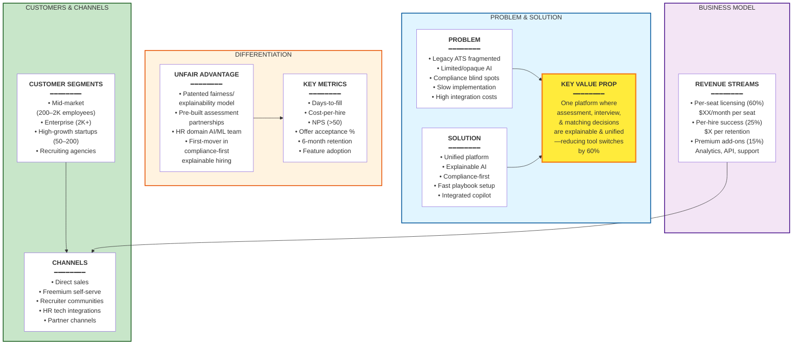

## Lean Canvas - Component Definitions

### 1. **PROBLEM** (Top-Left)

The core pain points that the market faces:

- Recruiting teams juggle 3–5 different tools (ATS, assessments, video interviews, background checks, candidate messaging)
- AI recommendations lack transparency ("Why did the system rank this candidate?")
- Compliance and bias risks are hard to track across fragmented systems
- Traditional ATS implementations take 3–6 months and require heavy customization
- High total cost of ownership from integration overhead

---

### 2. **SOLUTION** (Top-Middle)

How our product directly addresses each problem:

- **Unified Platform:** Assessment, interviews, and matching all in one tool
- **Explainable AI:** Every recommendation shows confidence scores and reasoning
- **Compliance-First Design:** Built-in fairness monitoring, audit logs, GDPR/privacy controls
- **Fast Playbook Setup:** Templates, automation rules, pre-configured workflows (4–6 week onboarding)
- **Recruiter Copilot:** Suggests next actions, flags bottlenecks, surfaces evidence for decisions

---

### 3. **UNIQUE VALUE PROPOSITION** (Center)

*"One platform where assessment, interview, and candidate matching decisions are explainable, unified, and auditable—reducing tool-switching by 60%, implementation time by 75%, and bias risk through transparent scoring."*

**Why it matters:**

- Recruiters save 10–15 hours/week from reduced tool-switching
- Hiring leaders gain confidence in hiring quality through transparent scoring
- Compliance teams reduce risk through built-in audit trails

---

### 4. **CUSTOMER SEGMENTS** (Middle-Left)

- **Mid-market (200–2K employees):** Primary target; scaling beyond small recruiting teams but not yet enterprise
- **Enterprise (2K+):** Seeking modern replacement for legacy ATS with better UX and faster implementation
- **High-growth startups (50–200):** Need professional recruiting infrastructure without enormous setup burden
- **Recruiting agencies & staffing firms:** High-volume hiring with white-label needs

---

### 5. **CHANNELS** (Middle-Right)

Go-to-market routes:

- **Direct Sales:** Enterprise account executives for mid-market and enterprise deals
- **Freemium Self-Serve:** SMBs can start free, upgrade as they scale
- **Recruiter Communities & Events:** Workshops, webinars on "explainable hiring" strategy
- **HR Tech Integrations:** Native Slack, Workday, BambooHR plugins for easy discovery
- **Partner Channels:** Recruiting software marketplaces, HR consulting firms, agencies

---

### 6. **UNFAIR ADVANTAGE** (Middle-Right, Upper)

What's hard for competitors to copy:

- **Patented Fairness Model:** Our AI evaluation engine includes built-in bias detection and explainability
- **Pre-Built Assessment Partnerships:** Deeply integrated with Codility, TestGorilla, Criteria (competitors must build from scratch)
- **HR Domain AI/ML Team:** Founders/early team have recruiting, HR tech, and ML expertise (not just engineers)
- **First-Mover in "Explainable Hiring" Category:** Own the trust/transparency narrative before competitors react

---

### 7. **KEY METRICS** (Lower-Right)

Success measures (6-month targets):

- **Days-to-fill:** 15-day reduction vs. customer baseline
- **Cost-per-hire:** Measurable reduction from fewer tool integrations
- **NPS (Recruiter):** > 50 (indicates strong product-market fit)
- **Offer acceptance rate:** Track to ensure quality of recommendations
- **6-month employee retention:** Measure hiring quality (not just speed)
- **Feature adoption:** 80%+ of users engage with copilot and explainability features

---

### 8. **REVENUE STREAMS** (Bottom)

- **Per-Seat Licensing (60% of revenue):** $X/month per recruiter or hiring manager seat; annual discounts for commitment
- **Per-Hire Success Fee (25% of revenue):** $X per candidate who successfully completes 6-month employment; aligns incentives
- **Premium Add-ons (15% of revenue):** Advanced analytics, whitelabel portal, API overages, dedicated success manager

**Target Unit Economics:**

- CAC (Customer Acquisition Cost): $15K–$30K
- LTV (Lifetime Value): $150K–$250K over 3–5 years
- LTV:CAC Ratio: 8–10x (healthy)

---

## Business Model Flow

```
PROBLEM (Fragmentation, Opacity, Time, Cost)
    ↓
SOLUTION (Unified + Explainable + Fast + Integrated)
    ↓
VALUE PROP (Save time, boost quality, reduce risk)
    ↓
CUSTOMER SEGMENTS (Mid-market, enterprise, startups, agencies)
    ↓
CHANNELS (Sales, freemium, communities, integrations)
    ↓
REVENUE (Seat-based + per-hire + premium)
    ↓
UNFAIR ADVANTAGE (Patented fairness, deep integrations, domain expertise)
    ↓
KEY METRICS (NPS, days-to-fill, retention, adoption)
    ↓
SUCCESS (8–10x LTV:CAC, $1M ARR by year 1)
```

---

## Why This Lean Canvas Works

1. **Problem-Solution Fit:** Each solution directly addresses a stated customer pain point
2. **Clear Differentiation:** We compete on **trust & transparency**, not just features
3. **Defensible Moat:** Unfair advantages are hard-to-replicate (proprietary fairness model, deep integrations, domain expertise)
4. **Scalable Unit Economics:** Blended revenue model (seats + per-hire) smooths growth and aligns incentives
5. **Measurable Success:** Key metrics tie directly to customer outcomes (hiring quality, speed, fairness)

---

## 9. Main Use Cases

### 9.1 Use Case 1: Publish and Activate a Job Opening

**Goal:** Launch a requisition quickly across all channels with governance and measurable performance.

**Primary actors:** Recruiter, Hiring Manager, ATS Platform.

**Business value:** Reduces time-to-post, enforces approval policies, and maximizes qualified applicant volume through multichannel distribution.

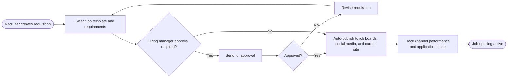

### 9.2 Use Case 2: AI-Assisted Screening and Assessment

**Goal:** Convert large applicant volume into a high-quality shortlist using transparent AI and assessments.

**Primary actors:** Candidate, Recruiter, ATS AI Copilot.

**Business value:** Increases recruiter throughput, reduces manual screening effort, and improves consistency in candidate evaluation.

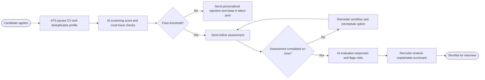

### 9.3 Use Case 3: Interview to Offer and Onboarding Trigger

**Goal:** Orchestrate interviews, decision-making, and offer communication in one controlled workflow.

**Primary actors:** Candidate, Interview Panel, Recruiter, Hiring Manager, ATS Platform.

**Business value:** Shortens hiring cycle, improves decision quality with structured evidence, and ensures seamless handoff to onboarding.

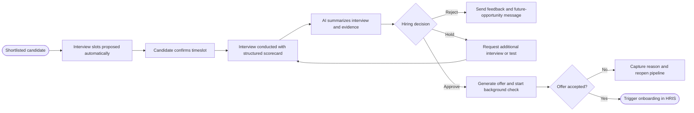

---

## 10. Use Cases in PlantUML

For these requirements, the most appropriate UML representation is a **Use Case Diagram**, because it clearly shows actors, system scope, and how each main use case relates to stakeholders.

### 10.1 Consolidated Use Case Diagram (PlantUML)


#### PlantUML Source Code
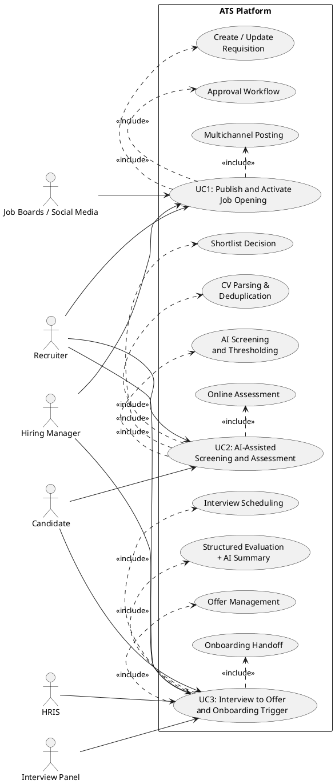

### 10.2 Use Case 1 Detail (PlantUML)


#### PlantUML Source Code
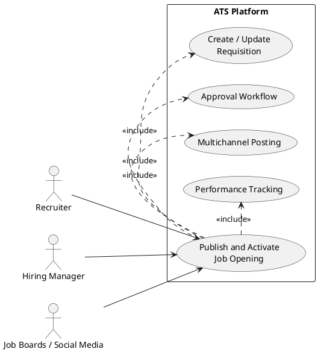

### 10.3 Use Case 2 Detail (PlantUML)


#### PlantUML Source Code
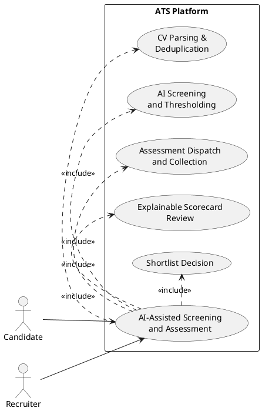

### 10.4 Use Case 3 Detail (PlantUML)


#### PlantUML Source Code
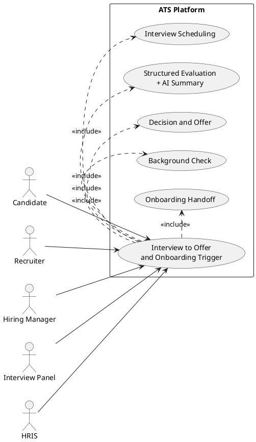

---

## 11. Data Model

### 11.1 Entity Overview

| Entity                   | Description                                                       |
| -------------------------- | ------------------------------------------------------------------- |
| **Company**              | Tenant that owns the ATS instance                                 |
| **User**                 | Internal staff: recruiters, hiring managers, interviewers, admins |
| **Job**                  | A role or requisition to be filled                                |
| **JobPosting**           | A published instance of a Job on a specific channel               |
| **Candidate**            | External person applying or being tracked                         |
| **Application**          | A Candidate's submission to a specific Job                        |
| **Assessment**           | A test or evaluation task assigned to a Candidate                 |
| **Interview**            | A scheduled interview session linked to an Application            |
| **InterviewParticipant** | Junction between Interview and Users (panelists)                  |
| **InterviewFeedback**    | A User's structured scoring after an Interview                    |
| **Offer**                | A formal job offer issued to a Candidate via an Application       |
| **Message**              | A communication record between system/recruiter and Candidate     |
| **TalentPool**           | A curated group of Candidates for future opportunities            |
| **TalentPoolMember**     | Junction between TalentPool and Candidate                         |
| **AuditLog**             | Immutable event record for compliance and AI override tracking    |

---

### 11.2 Entity Attributes and Relationships


#### PlantUML Source Code
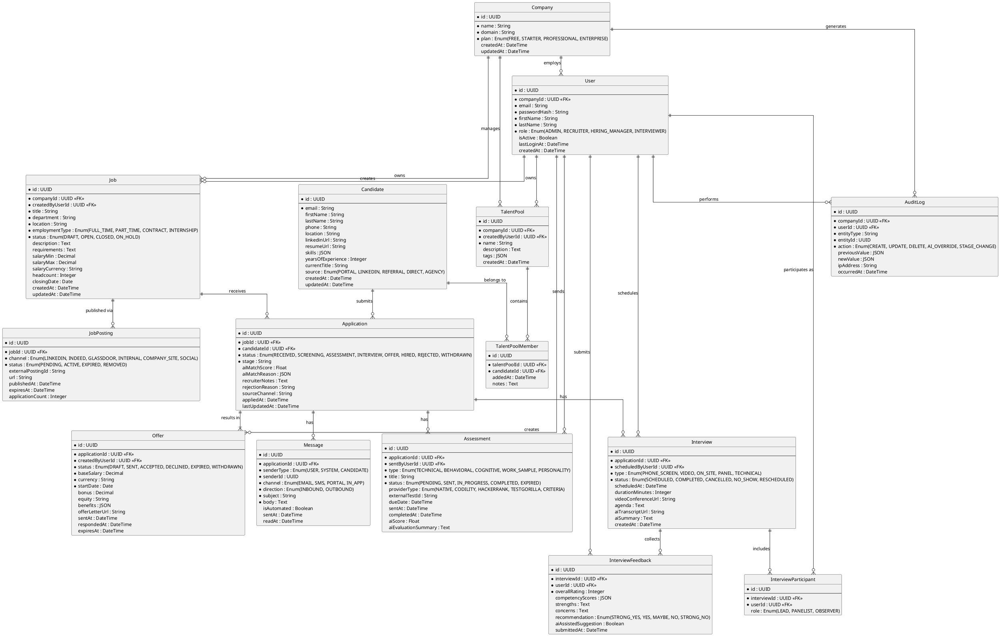

---

### 11.3 Key Relationship Summary

| Relationship                                | Cardinality | Notes                                                |
| --------------------------------------------- | ------------- | ------------------------------------------------------ |
| Company → User                             | 1:N         | Multi-tenant; all users scoped to one company        |
| Company → Job                              | 1:N         | Each company manages its own requisitions            |
| Job → JobPosting                           | 1:N         | One job can be posted to many channels               |
| Job → Application                          | 1:N         | Many candidates apply to the same job                |
| Candidate → Application                    | 1:N         | A candidate can apply to multiple jobs               |
| Application → Assessment                   | 1:N         | Multiple assessments can be assigned per application |
| Application → Interview                    | 1:N         | Multiple interview rounds per application            |
| Application → Offer                        | 1:0..1      | At most one active offer per application             |
| Application → Message                      | 1:N         | Complete communication history per application       |
| Interview → InterviewParticipant           | 1:N         | Panel interviews have multiple users                 |
| Interview → InterviewFeedback              | 1:N         | Each panelist submits independent feedback           |
| TalentPool → TalentPoolMember → Candidate | M:N         | Junction table enabling pool management              |
| Company → AuditLog                         | 1:N         | All AI overrides and stage changes are logged        |

---

## 12. System Design Options

> **Context for selection:** The ATS must serve multi-tenant companies, support AI-heavy workloads (resume parsing, scoring, interview summarization), handle async tasks (email dispatch, assessment grading), integrate with external partners (job boards, calendar, HRIS), and be audit-ready. The system design primer patterns applied: **Load balancer → horizontal scaling**, **Cache-aside**, **Message queues for async**, **Microservices** for independent scaling, and **CQRS** for read/write separation in AI workloads.

---

### Option A — Modular Monolith with Async Workers

**Summary:** A single deployable backend application organized into well-defined internal modules (Jobs, Applications, AI, Messaging, Integrations), backed by a task queue for all async operations and a read replica for reporting queries.

**Core architecture principals applied (from System Design Primer):**

- Horizontal scaling via load balancer in front of stateless web tier
- Cache-aside (Redis) for hot data: job listings, candidate scores, session tokens
- Message queue (e.g., Redis Queue / Celery) for AI scoring, email dispatch, test evaluation
- Read replica (PostgreSQL) for analytics dashboards — separate read from write path
- CDN for static assets (job postings, resume PDFs, offer letters)

**Fits best when:**

- Team size: 2–8 engineers; single deployment pipeline preferred
- Traffic: up to ~50K applications/month, ~200 concurrent users
- Budget: low operational overhead; single cloud deployment

| Strengths                                  | Weaknesses                                  |
| -------------------------------------------- | --------------------------------------------- |
| Fastest time-to-production                 | Single point of failure if monolith crashes |
| Easy local development and testing         | Harder to scale AI workloads independently  |
| Straightforward operational model          | Module coupling risk grows as team scales   |
| Async queue decouples AI from request path | Read replica lag can affect dashboards      |

---

### Option B — Domain-Oriented Microservices with Event Bus

**Summary:** The system is split into independently deployable services aligned with the core domains: **Job Service**, **Application Service**, **AI/Scoring Service**, **Assessment Service**, **Interview Service**, **Messaging Service**, **Integration Gateway**, and **Auth/Tenant Service**. Services communicate via a shared event bus (Kafka or RabbitMQ) for async flows, and REST/gRPC for synchronous calls. An API Gateway serves as the single entry point.

**Core architecture principals applied:**

- API Gateway as reverse proxy → routes, rate-limits, authenticates all traffic
- Each domain service scales independently (AI Service can have GPUs; Job Service needs only CPUs)
- Event bus (Kafka) for domain events: `ApplicationSubmitted`, `AssessmentCompleted`, `InterviewScheduled`
- Cache-aside per service (Redis) for local hot data
- CQRS within high-read services (e.g., Application Service separates command DB from query projections)
- Outbox pattern for reliable event publishing without distributed transactions
- CDN for file storage (resumes, offer letters via S3-compatible storage)

**Fits best when:**

- Team size: 8–25+ engineers; multiple squads aligned to domains
- Traffic: 50K–500K+ applications/month; >1,000 concurrent users
- Need to scale AI workloads (GPU instances) independently from CRUD services

| Strengths                                                    | Weaknesses                                                  |
| -------------------------------------------------------------- | ------------------------------------------------------------- |
| Each domain scales independently                             | Higher operational complexity (service mesh, observability) |
| AI/ML workloads isolated on dedicated compute                | Distributed tracing and debugging is harder                 |
| Team autonomy per domain                                     | Data consistency requires careful event design              |
| Fault isolation: AI service down does not block screening UI | Larger initial infrastructure investment                    |

---

### Option C — Event-Driven CQRS + Hybrid AI Platform

**Summary:** A hybrid approach that combines a pragmatic set of services with a strong **event-driven core** and **CQRS** for the read/write split across the entire platform. The write side uses a normalized SQL store (per-service); the read side materializes denormalized projections (Elasticsearch for candidate search, Redis for dashboards). An **AI Platform layer** is an isolated inference service that consumes events asynchronously, processes them through ML models, and publishes scored results back to a results store. An API Gateway + BFF (Backend for Frontend) layer serves the web app and mobile clients with tailored views.

**Core architecture principals applied:**

- CQRS end-to-end: commands → SQL write store; queries → Elasticsearch / Redis read projections
- Event sourcing for the Application aggregate: full state as immutable event log (perfect for AuditLog)
- Dedicated AI Platform: inference microservice with GPU-backed workers, model registry, and feature store
- BFF pattern: separate API aggregation layer per client type (Recruiter Web, Candidate Portal, HR Dashboard)
- CDN + object storage for all binary assets (CV PDFs, interview recordings, offer letters)
- Saga pattern for multi-step distributed workflows (e.g., Offer → Background Check → HRIS handoff)

**Fits best when:**

- Team size: 15–40+ engineers; dedicated AI/ML and platform engineering teams
- Traffic: enterprise-scale; 500K+ applications/month; complex reporting needs
- AI quality and explainability are core product differentiators requiring versioned models

| Strengths                                                        | Weaknesses                                               |
| ------------------------------------------------------------------ | ---------------------------------------------------------- |
| Best fit for explainable AI: event log is the ground truth       | Most complex to design and operate                       |
| Read projections deliver sub-100ms recruiter dashboards          | Event sourcing adds cognitive overhead for new engineers |
| AI Platform decoupled: model upgrades don't affect core services | Requires mature DevOps and MLOps practices from day one  |
| Audit log is first-class: every state change is an event         | Higher infrastructure cost vs. Options A and B           |

---

### Comparison Matrix

| Criterion                           | Option A: Modular Monolith | Option B: Microservices + Event Bus | Option C: CQRS + Event-Driven    |
| ------------------------------------- | ---------------------------- | ------------------------------------- | ---------------------------------- |
| **Time to first production deploy** | Fastest (weeks)            | Medium (months)                     | Slowest (months+)                |
| **Team size fit**                   | 2–8 engineers             | 8–25 engineers                     | 15–40+ engineers                |
| **Independent AI scaling**          | No (queue worker)          | Yes (dedicated service)             | Yes (isolated AI Platform)       |
| **Read performance (dashboards)**   | Good (read replica)        | Good (per-service cache)            | Best (Elasticsearch projections) |
| **Audit & compliance**              | Manual (AuditLog table)    | Event bus replay                    | First-class (event sourcing)     |
| **Operational complexity**          | Low                        | Medium                              | High                             |
| **Cost (infra + ops)**              | Low                        | Medium                              | High                             |
| **Recommended stage**               | MVP / seed / Series A      | Series A / B growth                 | Series B+ / enterprise           |

---

> **Next step:** Select one option (A, B, or C) and we will produce a full system design document with: architecture explanation, component breakdown, data flow, technology stack choices, and a detailed C4-level diagram.

---

## 13. System Design — Option A: Modular Monolith with Async Workers

### 13.1 Architecture Philosophy

**Selected pattern:** Modular Monolith + Async Worker Tier
**Design primer principles applied:** Horizontal scaling behind a load balancer · Cache-aside with Redis · Message queue for async decoupling · Read replica for query isolation · CDN for static/binary assets

The ATS MVP is deployed as a **single horizontally-scalable application** composed of strongly bounded internal modules. Each module owns its domain logic and communicates with other modules only through **well-defined service interfaces** (no direct cross-module DB queries). This enforces future extractability: any module can be promoted to a microservice when traffic warrants it.

All operations that do not need an immediate HTTP response are offloaded to an **async worker pool** via a Redis-backed task queue (BullMQ). This covers: AI resume scoring, email/SMS dispatch, assessment grading, multichannel job posting, and HRIS synchronization. The web tier stays fast and responsive under load.

---

### 13.2 High-Level Architecture Diagram

```mermaid
flowchart TB
    subgraph Clients["Client Layer"]
        WEB["Recruiter Web App (React SPA)"]
        CP["Candidate Portal (Next.js SSR)"]
        HRD["HR Dashboard (React SPA)"]
    end

    CDN["CDN\n(Static Assets · Resume PDFs · Offer Letters)"]

    LB["Load Balancer\n(AWS ALB / Nginx)"]

    subgraph AppTier["Application Tier — Modular Monolith (Horizontally Scaled Instances)"]
        AUTH["Auth Module\n(JWT · SSO/SAML · Multi-tenant)"]
        JOBS["Jobs Module\n(CRUD · Templates · Analytics)"]
        APP["Application Module\n(Lifecycle · Stages · AI Scoring)"]
        CAND["Candidate Module\n(Profiles · AI Matching · Talent Pools)"]
        ASMT["Assessment Module\n(Dispatch · Evaluation · Results)"]
        INTV["Interview Module\n(Scheduling · Feedback · AI Summary)"]
        MSG["Messaging Module\n(Unified Inbox · Templates · Triggers)"]
        INTG["Integration Module\n(Job Boards · HRIS · Calendar · BGC)"]
        AICO["AI Copilot Module\n(Recruiter Copilot · Bias Monitor)"]
        ANA["Analytics Module\n(Dashboards · Reports)"]
    end

    subgraph AsyncLayer["Async Layer"]
        RQ["Redis Task Queue (BullMQ)"]
        subgraph Workers["Autoscaled Worker Pool"]
            W1["AI Scoring Worker\n(Resume parse · Interview eval)"]
            W2["Email / SMS Worker\n(SendGrid · Twilio)"]
            W3["Assessment Eval Worker\n(AI open-answer grading)"]
            W4["Job Board Worker\n(LinkedIn · Indeed · Glassdoor)"]
            W5["HRIS Sync Worker\n(Workday · BambooHR)"]
        end
    end

    subgraph DataLayer["Data Layer"]
        PG_W["PostgreSQL Primary\n(Write — all commands)"]
        PG_R["PostgreSQL Read Replica\n(Reports · Analytics queries)"]
        REDIS["Redis\n(Cache-aside · Sessions · Queue broker)"]
        S3["Object Storage (S3)\n(Resumes · Recordings · Offer Letters)"]
    end

    subgraph External["External Integrations"]
        AI_API["OpenAI / LLM\nInference API"]
        EMAIL["SendGrid / AWS SES"]
        SMS["Twilio (SMS)"]
        BOARDS["LinkedIn · Indeed · Glassdoor APIs"]
        CAL["Google / Outlook Calendar"]
        VIDEO["Zoom / Microsoft Teams"]
        BGC["Checkr (Background Check)"]
        HRIS["Workday / BambooHR"]
    end

    WEB --> CDN
    CP --> CDN
    HRD --> CDN
    CDN --> LB
    LB --> AppTier

    AppTier --> RQ
    AppTier --> PG_W
    AppTier --> REDIS
    AppTier --> S3
    ANA --> PG_R

    RQ --> Workers

    W1 --> AI_API
    W2 --> EMAIL
    W2 --> SMS
    W3 --> AI_API
    W4 --> BOARDS
    W5 --> HRIS

    INTG --> CAL
    INTG --> VIDEO
    INTG --> BGC

    PG_W -->|streaming replication| PG_R
```

---

### 13.3 Component Breakdown

#### Client Layer

| Client            | Technology              | Purpose                                               |
| ------------------- | ------------------------- | ------------------------------------------------------- |
| Recruiter Web App | React SPA + React Query | Full ATS workflow: jobs, pipeline, copilot, analytics |
| Candidate Portal  | Next.js SSR             | Apply, track status, respond to tests and offers      |
| HR Dashboard      | React SPA               | Aggregate reporting, pipeline health, D&I metrics     |

All clients fetch static assets and binary files (PDFs, logos) through the **CDN**. File uploads (resumes, recordings) go directly to S3 via a pre-signed URL issued by the Integration Module — the monolith never handles binary streams.

#### Edge / Ingress

- **CDN (CloudFront/Cloudflare):** Caches static SPA bundles, pre-signed file URLs, and public job pages. Absorbs the majority of read traffic before it reaches the app.
- **Load Balancer (AWS ALB / Nginx):** Distributes HTTP requests across **N stateless monolith instances**. Health-checks each instance; terminates TLS. Sticky sessions are intentionally avoided — the Auth Module issues stateless JWTs, and session data lives in Redis.

#### Application Tier (Modular Monolith)

Each module is a self-contained package (Node.js/Fastify or Python/FastAPI). Internal calls are direct function/service calls, **not** HTTP. Modules share a single connection pool to PostgreSQL and a single Redis client.

| Module          | Responsibility                                                 | Key operations                                                         |
| ----------------- | ---------------------------------------------------------------- | ------------------------------------------------------------------------ |
| **Auth**        | JWT issuance, SSO/SAML, multi-tenant context injection, RBAC   | Login, token refresh, impersonation, permission checks                 |
| **Jobs**        | Requisition CRUD, template management, approval workflow       | Create/edit/close jobs, trigger posting queue task                     |
| **Application** | Application lifecycle state machine, AI score display          | Receive application, transition stages, fetch AI scorecard             |
| **Candidate**   | Profile management, talent pool, AI match display              | Parse resume (enqueue task), search candidates, pool management        |
| **Assessment**  | Send/receive/display tests, integrate external providers       | Dispatch assessment (enqueue), receive webhook, display results        |
| **Interview**   | Calendar scheduling, structured evaluation, AI summary display | Propose slots, confirm, collect feedback, show AI transcript summary   |
| **Messaging**   | Unified inbox, templates, auto-trigger engine                  | Send messages, track delivery, auto-trigger on stage change            |
| **Integration** | Outbound adapters for all external APIs                        | Issue pre-signed S3 URLs, proxy calendar/video/BGC API calls           |
| **AI Copilot**  | Surfaces AI recommendations and bias alerts to the UI          | Query cached scores, render explanations, log AI overrides to AuditLog |
| **Analytics**   | Query read replica, aggregate metrics, render dashboards       | Time-to-fill, funnel conversion, cost-per-hire, D&I pass rates         |

#### Async Worker Tier

Workers are **separate processes** sharing the same codebase, deployed alongside the monolith on identical hosts (or as a separately-scaled container set). They pull jobs from **BullMQ** queues in Redis.

| Worker                     | Queue name                             | What it does                                                                                                                                        |
| ---------------------------- | ---------------------------------------- | ----------------------------------------------------------------------------------------------------------------------------------------------------- |
| **AI Scoring Worker**      | `ai:resume-score`, `ai:interview-eval` | Sends resume text + JD to LLM, receives structured score + reasoning JSON, writes back to`Application.aiMatchScore` and `Application.aiMatchReason` |
| **Email / SMS Worker**     | `notify:email`, `notify:sms`           | Renders template, sends via SendGrid/SES or Twilio, writes delivery record to`Message` table                                                        |
| **Assessment Eval Worker** | `assess:evaluate`                      | Sends open-ended answers to LLM for grading, writes`Assessment.aiScore` and `Assessment.aiEvaluationSummary`                                        |
| **Job Board Worker**       | `posting:distribute`                   | Calls LinkedIn/Indeed/Glassdoor APIs per distribution rule, writes`JobPosting` records                                                              |
| **HRIS Sync Worker**       | `hris:onboard`                         | Pushes hired candidate data to Workday/BambooHR when offer is accepted                                                                              |

Workers are **idempotent** (safe to retry) and use **exponential backoff** with a dead-letter queue for failed jobs.

#### Data Layer

| Store                       | Role                                                         | Access pattern                                                                           |
| ----------------------------- | -------------------------------------------------------------- | ------------------------------------------------------------------------------------------ |
| **PostgreSQL Primary**      | Single source of truth for all writes                        | All command operations go here; connection pooling via PgBouncer                         |
| **PostgreSQL Read Replica** | Analytics and dashboard queries                              | Analytics Module queries only; lag < 1s acceptable for reporting                         |
| **Redis**                   | Cache-aside for hot data + task queue broker + session store | Cache: candidate scores, job listings (TTL 5 min). Queue: BullMQ. Sessions: JWT denylist |
| **S3 Object Storage**       | Binary asset store                                           | Resumes, interview recordings, offer letters, report exports                             |

**Cache-aside strategy:** When the Application Module reads a candidate's AI score, it checks Redis first (`candidate:{id}:score`). On miss it hits PostgreSQL and populates the cache (TTL 5 min). Workers invalidate the cache key after writing a new score.

---

### 13.4 Key Data Flows

#### Flow 1 — Candidate Applies

```
Candidate Portal
  → POST /applications (Load Balancer → Monolith)
    → Application Module: create Application row (status=RECEIVED)
    → Candidate Module: upsert Candidate profile
    → Enqueue task: ai:resume-score {applicationId}
    → Enqueue task: notify:email {template=APPLICATION_RECEIVED, candidateId}
  ← HTTP 201 (immediate response)

[async] AI Scoring Worker
  → Fetch resume text from S3
  → Call LLM API with resume + JD
  → Write aiMatchScore, aiMatchReason to Application
  → Invalidate Redis key candidate:{id}:score
  → Enqueue task: notify:email {template=RECRUITER_NEW_SCORED_APP, recruiterId}

[async] Email Worker
  → Render confirmation email
  → Call SendGrid API
  → Write Message row (direction=OUTBOUND, channel=EMAIL)
```

#### Flow 2 — Recruiter Publishes a Job

```
Recruiter Web App
  → POST /jobs/{id}/publish (Load Balancer → Monolith)
    → Jobs Module: set Job.status = OPEN
    → Integration Module: validate distribution rules
    → Enqueue tasks: posting:distribute per channel
  ← HTTP 200 (immediate response)

[async] Job Board Worker (one task per channel)
  → Call LinkedIn/Indeed/Glassdoor API
  → Write JobPosting row (status=ACTIVE, externalPostingId, url)
```

#### Flow 3 — Interview Completed → AI Summary

```
Interviwer submits feedback
  → POST /interviews/{id}/feedback (Monolith)
    → Interview Module: write InterviewFeedback row
    → Check: all panelists submitted?
      → Yes: Enqueue: ai:interview-eval {interviewId}
  ← HTTP 201

[async] AI Scoring Worker
  → Fetch all InterviewFeedback rows for interviewId
  → Fetch agenda + questionnaire from Interview row
  → Call LLM: summarize + extract strengths/concerns with confidence
  → Write Interview.aiSummary, Interview.aiTranscriptUrl
  → Notify recruiter via notify:email
```

---

### 13.5 Technology Stack

| Layer                    | Choice                                         | Rationale                                                          |
| -------------------------- | ------------------------------------------------ | -------------------------------------------------------------------- |
| **Backend language**     | Node.js (TypeScript) + Fastify                 | Fast I/O, strong ecosystem, monorepo-friendly                      |
| **ORM / Query builder**  | Drizzle ORM or Prisma                          | Type-safe SQL, migration support                                   |
| **API style**            | REST (JSON) + OpenAPI spec                     | Broad tooling, easy for partner integrations                       |
| **Task queue**           | BullMQ (Redis-backed)                          | Battle-tested, built-in retries, dead-letter, rate limiting        |
| **Frontend**             | React + React Query + Tailwind                 | Fast UX iteration, SPA + SSR for candidate portal                  |
| **Primary DB**           | PostgreSQL 16                                  | ACID, JSONB for AI payloads, mature managed offerings (AWS RDS)    |
| **Cache / Queue broker** | Redis 7 (AWS ElastiCache)                      | Dual-purpose: cache-aside + BullMQ broker                          |
| **Object storage**       | AWS S3 + CloudFront CDN                        | Managed, durable, pre-signed URL pattern for direct uploads        |
| **Auth**                 | JWT (access + refresh tokens) + SAML 2.0 (SSO) | Stateless horizontal scaling; SSO for enterprise tenants           |
| **AI / LLM**             | OpenAI API (gpt-4o) or self-hosted vLLM        | Pluggable provider; abstracted behind AI Copilot Module            |
| **Email**                | SendGrid (transactional)                       | Deliverability, template management, webhook for delivery tracking |
| **SMS**                  | Twilio                                         | Global reach, opt-in compliance                                    |
| **Deployment**           | Docker + AWS ECS (Fargate) or Railway          | Containerized; auto-scaling on CPU/memory; zero-downtime deploys   |
| **CI/CD**                | GitHub Actions                                 | PR checks, migration dry-run, staging deploy, prod deploy          |
| **Observability**        | Datadog or OpenTelemetry + Grafana             | Logs, metrics, APM traces, queue depth alerts                      |

---

### 13.6 Scalability and Resilience Decisions

| Concern                        | Decision                                                                                                                                             |
| -------------------------------- | ------------------------------------------------------------------------------------------------------------------------------------------------------ |
| **Horizontal scaling**         | All monolith instances are stateless; no session affinity needed. Scale out by adding instances behind the ALB                                       |
| **Database connection limits** | PgBouncer connection pooler sits between app instances and PostgreSQL to prevent connection exhaustion at scale                                      |
| **AI latency**                 | All AI calls are**async** (queue + worker). The HTTP response to the user is immediate; score appears when ready                                     |
| **Worker overload**            | BullMQ concurrency limits per worker type; dedicated worker containers for AI jobs (higher CPU/memory)                                               |
| **Cache invalidation**         | Cache-aside with TTL; workers explicitly invalidate stale keys after writes                                                                          |
| **Privacy / GDPR**             | Candidate data encrypted at rest (RDS encryption + S3 SSE); TLS in transit; PII fields flagged in ORM; right-to-erasure endpoint in Candidate Module |
| **Audit trail**                | Every stage transition and AI override writes to`AuditLog` table synchronously before HTTP response                                                  |
| **Availability target**        | 99.9% (three-nines): ALB health checks, multi-AZ RDS, Redis replication, S3 eleven-nines durability                                                  |

---

### 13.7 C4 Diagram — Application Module (Component Level)

The **Application Module** is the most critical component: it drives the entire hiring funnel, triggers AI scoring, and coordinates with every other module. The following C4 Component diagram zooms into its internal structure.


#### PlantUML Source Code
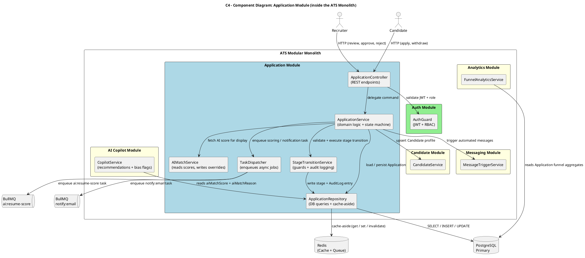

---

### 13.8 Module Dependency Rules (Enforced at Dev Time)

To prevent the monolith from becoming a "big ball of mud", the following rules are enforced via lint tooling (e.g., dependency-cruiser):

1. **Modules MUST NOT** import directly from another module's repository layer.
   All cross-module calls go through the module's public `Service` interface.
2. **The Analytics Module** MUST only read from the **read replica** — never the primary.
3. **The AI Copilot Module** MUST NOT write to any domain table directly.
   It reads scores from the Application repository and writes only to `AuditLog` (via AuditService).
4. **Workers** MUST NOT import HTTP controllers.
   They share domain services and repositories, but the transport layer is strictly separated.
5. **Any cross-module event** (e.g., "application stage changed") is published via an **in-process event emitter** (Node EventEmitter or NestJS EventBus), ensuring future extractability to a real message bus.

---

### 13.9 C4 Diagram - Candidate Module (Detailed Component View)

The Candidate Module is responsible for candidate profile lifecycle, resume ingestion, AI enrichment, search, and talent pool membership. It must support high read throughput for recruiter searches while keeping writes consistent and auditable.


#### PlantUML Source Code
```plantuml
@startuml C4_Candidate_Module
skinparam componentStyle rectangle
skinparam rectangle {
  BackgroundColor White
  BorderColor #444
}

title C4 - Component Diagram: Candidate Module (inside the ATS Monolith)

actor Recruiter
actor Candidate

rectangle "ATS Modular Monolith" {

  rectangle "Candidate Module" #LightBlue {
    component [CandidateController\n(REST endpoints)] as CC
    component [CandidateService\n(profile lifecycle orchestration)] as CVS
    component [ResumeIngestionService\n(upload, parse trigger, validation)] as RIS
    component [CandidateSearchService\n(filters, ranking, pagination)] as CSS
    component [AIMatchReadService\n(reads explainable match scores)] as AMR
    component [TalentPoolService\n(pool membership and tagging)] as TPS
    component [ConsentAndPrivacyService\n(GDPR, retention, erase)] as CPS
    component [CandidateRepository\n(candidates table + cache-aside)] as CR
    component [TalentPoolRepository\n(pool and member persistence)] as TR
    component [AuditPublisher\n(audit + domain events)] as AP
    component [TaskDispatcher\n(enqueue async jobs)] as TD
  }

  rectangle "Auth Module" #LightGreen {
    component [AuthGuard\n(JWT + RBAC + tenant scoping)] as AG
  }

  rectangle "Application Module" #LightYellow {
    component [ApplicationService\n(upsert candidate on apply)] as AS
  }

  rectangle "AI Copilot Module" #LightYellow {
    component [CopilotService\n(read candidate AI context)] as CPL
  }

  rectangle "Messaging Module" #LightYellow {
    component [MessageTriggerService\n(profile update notifications)] as MTS
  }

  rectangle "Integration Module" #LightYellow {
    component [StorageAdapter\n(pre-signed URL + object references)] as SA
  }
}

database "PostgreSQL Primary\n(Candidate, TalentPool, AuditLog)" as PG
database "PostgreSQL Read Replica\n(search/report reads)" as PGR
database "Redis\n(cache-aside + short-lived indexes)" as REDIS
database "Object Storage S3\n(resumes, profile documents)" as S3

queue "BullMQ\nai:resume-score" as Q_AI
queue "BullMQ\nnotify:email" as Q_NOTIFY

Recruiter --> CC : HTTP (search, update profile, manage pools)
Candidate --> CC : HTTP (profile updates, consent actions)
AS --> CC : internal call (candidate upsert on application)

CC --> AG : authenticate + authorize
CC --> CVS : delegate command/query

CVS --> RIS : process resume upload workflow
CVS --> CSS : execute recruiter search
CVS --> AMR : attach AI match explanation
CVS --> TPS : manage talent pools
CVS --> CPS : enforce consent/retention policy
CVS --> CR : read/write candidate aggregate
CVS --> TR : read/write pool membership
CVS --> AP : publish audit and domain events
CVS --> TD : enqueue async work

RIS --> SA : request pre-signed upload URL
RIS --> CR : persist resume metadata and status
RIS --> TD : enqueue ai:resume-score

CSS --> REDIS : cache get/set (hot recruiter queries)
CSS --> PGR : read-heavy candidate search
AMR --> CR : fetch aiMatchScore + aiMatchReason

TPS --> TR : persist pool and member links
CPS --> CR : anonymize/delete candidate data
CPS --> AP : emit GDPR_ERASURE audit event

CR --> PG : INSERT/UPDATE/SELECT candidate
TR --> PG : INSERT/UPDATE/SELECT pool/member
AP --> PG : INSERT AuditLog

TD --> Q_AI : enqueue ai scoring task
TD --> Q_NOTIFY : enqueue profile-change notification

SA --> S3 : upload/download via object keys

CPL --> CR : read candidate AI context
MTS --> Q_NOTIFY : trigger outbound comms

@enduml
```

#### Candidate Module Responsibilities (Summary)

| Component                | Responsibility                                  | Scalability note                              |
| -------------------------- | ------------------------------------------------- | ----------------------------------------------- |
| CandidateController      | Candidate-facing and recruiter-facing endpoints | Stateless, safe for horizontal scaling        |
| CandidateService         | Central orchestration and invariants            | Keeps module logic cohesive and extractable   |
| ResumeIngestionService   | File reference workflow and parsing trigger     | Heavy work shifted async to workers           |
| CandidateSearchService   | Fast candidate lookup with filters              | Uses read replica + Redis cache-aside         |
| TalentPoolService        | Pool curation and membership                    | M:N handling through dedicated repository     |
| ConsentAndPrivacyService | GDPR erase/anonymize and retention rules        | Guarantees compliance actions are auditable   |
| CandidateRepository      | Canonical persistence layer                     | Single write path to primary DB               |
| AuditPublisher           | Immutable trace of sensitive actions            | Critical for compliance and AI explainability |

# Final Notes

system-design-primer-master folder is not added to the code base.

