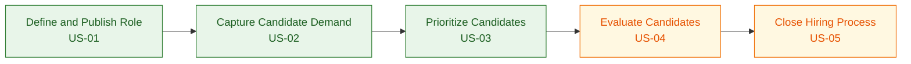

# User Stories: ATS MVP

Based on the PRD, the following five user stories cover the core MVP hiring flow from job creation to offer.

## US-01: Create and Publish a Job Opening

**Story title:** Create and publish a requisition

**User story:**  
As a recruiter, I want to create, approve, and publish a job opening, so that I can start receiving qualified applications without using multiple tools.

**Acceptance criteria:**
- Given I am an authorized recruiter, when I create a new requisition, then I can enter the role title, description, hiring requirements, and location.
- Given the company uses approval workflows, when I submit the requisition, then it is routed to the hiring manager before publishing.
- Given the requisition is approved, when I publish it, then it becomes visible on the careers page and selected distribution channels.
- Given the job is live, when I view the requisition, then I can see its status as active.

**Complexity estimate:** M

**INVEST evaluation:**
- Independent: Can be delivered as the first MVP capability.
- Negotiable: Approval logic and publishing channels can be refined with the team.
- Valuable: Unlocks the hiring funnel and applicant intake.
- Estimable: Scope is clear and bounded.
- Small: Fits one sprint if external channel coverage is limited.
- Testable: Publish and approval behaviors are measurable.

**Assumptions:**
- MVP supports a limited set of publishing channels.
- Approval can be configured as required or optional.

**Out of scope:**
- Advanced job board marketplace coverage.
- Complex enterprise workflow customization.

**Dependencies:**
- User roles and permissions.
- Basic job template and requisition data model.

**Suggested split:**
- First slice: create and publish to careers page only.
- Follow-up slice: distribute to external job channels.

## US-02: Submit and Track an Application

**Story title:** Candidate applies and tracks status

**User story:**  
As a candidate, I want to apply for a job and track my application status, so that I know my progress and next steps.

**Acceptance criteria:**
- Given I am on an active job posting, when I submit my application and resume, then the system creates or updates my candidate profile.
- Given my resume was already submitted previously, when I apply again, then the system detects a possible duplicate and preserves one consolidated profile.
- Given I have applied, when I access the candidate portal, then I can see my current application stage.
- Given the recruiter updates my stage, when I revisit the portal, then the latest status is visible.

**Complexity estimate:** M

**INVEST evaluation:**
- Independent: Delivers candidate-facing value with minimal coupling.
- Negotiable: Portal detail level can be adjusted without changing the core story.
- Valuable: Reduces candidate confusion and supports a complete intake flow.
- Estimable: Core scope is clear.
- Small: Fits MVP if portal scope stays narrow.
- Testable: Application creation, deduplication, and status visibility are verifiable.

**Assumptions:**
- Candidate login or secure status access is available.
- Deduplication uses resume and contact matching.

**Out of scope:**
- Full candidate messaging inbox.
- Multi-language portal support.

**Dependencies:**
- Job publishing from US-01.
- Candidate profile and application entities.

**Suggested split:**
- First slice: apply and view submitted status.
- Follow-up slice: richer portal actions such as rescheduling and document uploads.

## US-03: Review Explainable AI Screening Results

**Story title:** Recruiter reviews AI-assisted screening

**User story:**  
As a recruiter, I want to see AI-generated candidate scores with explanations, so that I can prioritize the strongest applicants faster and with more confidence.

**Acceptance criteria:**
- Given a candidate has applied, when screening is completed, then I can see a match score against the job requirements.
- Given a score is displayed, when I open the candidate summary, then I can see the main reasons for the score, including matched and missing criteria.
- Given AI flags a concern, when I review the result, then the concern is shown with supporting evidence.
- Given I disagree with the recommendation, when I manually change the decision, then the override is saved with a reason.

**Complexity estimate:** M

**INVEST evaluation:**
- Independent: Can be built once candidate intake exists.
- Negotiable: Scoring model and explanation format can evolve.
- Valuable: Delivers core differentiation of the product.
- Estimable: Focused on presenting screening outcomes, not full automation.
- Small: Achievable if limited to must-have criteria and simple explanations.
- Testable: Score visibility, evidence display, and override logging are measurable.

**Assumptions:**
- MVP AI scoring uses a defined set of job requirements.
- Recruiters remain the final decision-makers.

**Out of scope:**
- Automated rejection without human review.
- Advanced bias analytics dashboard.

**Dependencies:**
- Candidate application intake from US-02.
- Job requirement data from US-01.
- Audit logging.

**Suggested split:**
- First slice: show score and top reasons.
- Follow-up slice: add fairness flags and richer override analytics.

## US-04: Coordinate Assessment and Interview Evaluation

**Story title:** Move shortlisted candidates through evaluation

**User story:**  
As a recruiter, I want to send assessments, schedule interviews, and collect structured feedback, so that I can evaluate shortlisted candidates in a consistent and efficient way.

**Acceptance criteria:**
- Given a candidate passes screening, when I trigger an assessment, then the candidate receives the assessment request.
- Given an assessment is completed, when I review the application, then I can see completion status and result summary.
- Given a candidate is ready for interviews, when I schedule an interview, then the event is created with the selected participants.
- Given interviewers submit feedback, when I review the candidate, then I can see structured feedback in one place.

**Complexity estimate:** L

**INVEST evaluation:**
- Independent: Provides a distinct evaluation workflow after screening.
- Negotiable: Assessment provider and scheduling implementation can vary.
- Valuable: Moves the hiring decision forward with consistent evidence.
- Estimable: Larger than the other stories but still bounded.
- Small: Borderline for one sprint; best delivered as vertical slices.
- Testable: Assessment dispatch, scheduling, and feedback collection are verifiable.

**Assumptions:**
- MVP supports one assessment pattern and basic scheduling.
- Structured interview feedback uses a standard template.

**Out of scope:**
- Deep calendar ecosystem coverage.
- AI transcription for all interview formats.

**Dependencies:**
- Shortlisted candidates from US-03.
- User roles for interviewers and hiring managers.

**Suggested split:**
- First slice: assessment send and result tracking.
- Second slice: interview scheduling.
- Third slice: structured feedback capture.

## US-05: Issue an Offer and Trigger Onboarding Handoff

**Story title:** Finalize hiring decision with offer handoff

**User story:**  
As a recruiter, I want to generate an offer and trigger onboarding handoff after acceptance, so that I can close the hiring process without manual follow-up across systems.

**Acceptance criteria:**
- Given a candidate is approved, when I generate an offer, then the system creates an offer linked to the application.
- Given the candidate receives the offer, when they accept or reject it, then the offer status is updated.
- Given the offer is accepted, when the final decision is confirmed, then onboarding handoff is triggered to the connected HRIS.
- Given the hiring flow is completed, when I review the application, then I can see the final outcome recorded.

**Complexity estimate:** M

**INVEST evaluation:**
- Independent: Delivers the final conversion step in the hiring funnel.
- Negotiable: Offer approval and HRIS details can be adapted later.
- Valuable: Converts recruiting effort into a completed hire.
- Estimable: Scope is clear if limited to one HRIS handoff path.
- Small: Reasonable for MVP with simplified offer handling.
- Testable: Offer creation, status updates, and handoff event can be verified.

**Assumptions:**
- MVP uses a basic offer workflow.
- One HRIS handoff pattern is sufficient for the first release.

**Out of scope:**
- Complex compensation approval chains.
- Multi-country employment package logic.

**Dependencies:**
- Candidate evaluation flow from US-04.
- HRIS integration endpoint or export mechanism.

**Suggested split:**
- First slice: create and track offer status.
- Follow-up slice: automated onboarding handoff.

## MVP Prioritization Order

### Priority 1: US-01 Create and Publish a Job Opening
This is the entry point of the recruiting workflow. Without a published requisition, there is no intake, screening, or downstream funnel.

### Priority 2: US-02 Submit and Track an Application
Once jobs are live, the platform must capture applicants and create the candidate/application records that all later stages rely on.

### Priority 3: US-03 Review Explainable AI Screening Results
This is the core differentiator of the product. It turns raw applications into prioritized candidates and directly supports the product promise of explainable AI.

### Priority 4: US-04 Coordinate Assessment and Interview Evaluation
After candidates are screened, the team needs a structured way to validate them. This story deepens evaluation quality but depends on the first three stories being in place.

### Priority 5: US-05 Issue an Offer and Trigger Onboarding Handoff
This completes the end-to-end journey, but it should come after the system can reliably create pipeline flow and evaluation evidence. It is important, but it does not create early funnel value by itself.

## Prioritization Rationale

The proposed order follows the natural sequence of the MVP hiring funnel described in the PRD:

1. Create demand intake.
2. Capture applications.
3. Prioritize candidates with explainable AI.
4. Evaluate shortlisted candidates.
5. Close the hire.

This ordering is the most pragmatic for an MVP because it delivers a usable slice of the platform as early as possible, while also validating the strongest business assumption: recruiters will adopt a unified ATS if it reduces manual effort and improves decision confidence.

## User Story Map

### Story Map Backbone (Ordered Activities)

| Backbone Activity | Story ID | Story Name | Primary Actor |
| --- | --- | --- | --- |
| Define and publish role | US-01 | Create and Publish a Job Opening | Recruiter |
| Capture candidate demand | US-02 | Submit and Track an Application | Candidate |
| Prioritize candidates | US-03 | Review Explainable AI Screening Results | Recruiter |
| Evaluate shortlisted candidates | US-04 | Coordinate Assessment and Interview Evaluation | Recruiter and Interview Panel |
| Close hiring process | US-05 | Issue an Offer and Trigger Onboarding Handoff | Recruiter |

### Release Slicing

#### MVP
- US-01: Create and Publish a Job Opening
- US-02: Submit and Track an Application
- US-03: Review Explainable AI Screening Results

#### Version 2
- US-04: Coordinate Assessment and Interview Evaluation
- US-05: Issue an Offer and Trigger Onboarding Handoff

### Why This MVP vs Version 2 Split

The split follows flow dependency, business value, and risk reduction:

1. US-01, US-02, and US-03 establish a complete minimum funnel from requisition to explainable candidate prioritization.
2. These stories validate the core product promise quickly: unified workflow and transparent AI support.
3. US-04 and US-05 add deeper operational and integration complexity, so they are better placed in Version 2 after the upstream funnel is stable.

### Mermaid User Story Map

## Ticket Split for US-01: Create and Publish a Job Opening

### Backbone Flow (US-01)
1. Create requisition draft
2. Validate required fields
3. Submit for approval (if enabled)
4. Capture approval decision
5. Publish to careers page
6. Distribute to external channels (optional MVP+, default V2)
7. Show active status and publication logs

### Ticket List
- TS-001: Requisition data model and API contract
- TS-002: Requisition creation form (draft)
- TS-003: Requisition validation rules
- TS-004: Approval workflow configuration
- TS-005: Submit and review approval request
- TS-006: Publish approved requisition to careers page
- TS-007: Requisition status tracking and audit trail
- TS-008: External channel publisher adapter (initial provider)
- TS-009: Publication job retries and failure handling

### Ticket Details

#### TS-001
- Title: Requisition data model and API contract
- Story - Detailed description: Define persistent schema and CRUD API for requisitions (draft lifecycle only).
- Acceptance criteria (Given/When/Then):
    - Given a recruiter creates a requisition, when required fields are provided, then a draft requisition is stored with unique ID.
    - Given a requisition exists, when it is fetched, then title, description, requirements, location, and lifecycle status are returned.
- Priority: Highest
- Dependencies: None
- Release: MVP
- Effort estimation: 1.5 days
- Tags: Backend, API, Data
- Links or References: US-01, PRD Section 7.1
- Change History: v1 initial split

#### TS-002
- Title: Requisition creation form (draft)
- Story - Detailed description: Build recruiter UI to create and save a requisition draft.
- Acceptance criteria (Given/When/Then):
    - Given an authorized recruiter, when they open new requisition, then the form shows title, description, requirements, and location fields.
    - Given valid inputs, when recruiter saves, then draft is persisted and a success message is shown.
- Priority: Highest
- Dependencies: TS-001
- Release: MVP
- Effort estimation: 2 days
- Tags: Frontend, UX
- Links or References: US-01 AC-1
- Change History: v1 initial split

#### TS-003
- Title: Requisition validation rules
- Story - Detailed description: Enforce server-side and client-side validation for required requisition fields.
- Acceptance criteria (Given/When/Then):
    - Given required data is missing, when recruiter submits, then validation errors are displayed by field.
    - Given all required fields are valid, when recruiter submits, then request succeeds without validation errors.
- Priority: Highest
- Dependencies: TS-001, TS-002
- Release: MVP
- Effort estimation: 1 day
- Tags: Backend, Frontend, Validation
- Links or References: US-01 AC-1
- Change History: v1 initial split

#### TS-004
- Title: Approval workflow configuration
- Story - Detailed description: Add per-company toggle to enable or disable approval before publication.
- Acceptance criteria (Given/When/Then):
    - Given approval workflow is enabled, when requisition is submitted, then publication is blocked until approved.
    - Given approval workflow is disabled, when requisition is submitted, then it can proceed directly to publish.
- Priority: High
- Dependencies: TS-001
- Release: MVP
- Effort estimation: 1 day
- Tags: Backend, Configuration
- Links or References: US-01 AC-2
- Change History: v1 initial split

#### TS-005
- Title: Submit and review approval request
- Story - Detailed description: Implement submit-for-approval action and hiring-manager approve/reject decision flow.
- Acceptance criteria (Given/When/Then):
    - Given approval is required, when recruiter submits, then request appears in hiring manager queue.
    - Given a pending request, when hiring manager approves or rejects, then requisition status is updated and recruiter is notified.
- Priority: High
- Dependencies: TS-004
- Release: MVP
- Effort estimation: 2 days
- Tags: Backend, Frontend, Workflow
- Links or References: US-01 AC-2
- Change History: v1 initial split

#### TS-006
- Title: Publish approved requisition to careers page
- Story - Detailed description: Publish requisition to internal careers page and mark it active.
- Acceptance criteria (Given/When/Then):
    - Given a requisition is approved (or approval not required), when recruiter publishes, then requisition is visible on careers page.
    - Given publication succeeds, when recruiter views requisition details, then status shows Active.
- Priority: Highest
- Dependencies: TS-003, TS-005
- Release: MVP
- Effort estimation: 1.5 days
- Tags: Backend, Frontend, Publishing
- Links or References: US-01 AC-3, AC-4
- Change History: v1 initial split

#### TS-007
- Title: Requisition status tracking and audit trail
- Story - Detailed description: Record lifecycle transitions (Draft, Pending Approval, Approved, Active, Rejected) and actor metadata.
- Acceptance criteria (Given/When/Then):
    - Given any status transition, when action is executed, then event is logged with timestamp and actor.
    - Given recruiter opens requisition timeline, when history exists, then transitions are shown in chronological order.
- Priority: High
- Dependencies: TS-001, TS-005, TS-006
- Release: MVP
- Effort estimation: 1 day
- Tags: Backend, Audit, Compliance
- Links or References: US-01 AC-4
- Change History: v1 initial split

#### TS-008
- Title: External channel publisher adapter (initial provider)
- Story - Detailed description: Add first external publishing adapter (for one selected job board) behind a provider interface.
- Acceptance criteria (Given/When/Then):
    - Given recruiter selects external distribution, when requisition is published, then publish request is sent to configured provider.
    - Given provider responds success, when recruiter checks publications, then external channel status is shown as Published.
- Priority: Medium
- Dependencies: TS-006
- Release: Version 2
- Effort estimation: 2 days
- Tags: Integration, Backend
- Links or References: US-01 suggested split follow-up
- Change History: v1 initial split

#### TS-009
- Title: Publication retries and failure handling
- Story - Detailed description: Implement retry strategy and failure states for external publication jobs.
- Acceptance criteria (Given/When/Then):
    - Given an external publish call fails transiently, when retry policy applies, then system retries up to configured attempts.
    - Given retries are exhausted, when recruiter views publication details, then channel status shows Failed with reason.
- Priority: Medium
- Dependencies: TS-008
- Release: Version 2
- Effort estimation: 1.5 days
- Tags: Backend, Reliability, Integration
- Links or References: US-01 follow-up reliability
- Change History: v1 initial split

### Prioritized Implementation Sequence
1. TS-001
2. TS-002
3. TS-003
4. TS-004
5. TS-005
6. TS-006
7. TS-007
8. TS-008
9. TS-009

### MVP vs Version 2 Rationale (US-01)
- MVP includes TS-001 to TS-007 to deliver a complete internal flow: create requisition, route approval, publish on careers page, and verify active status with auditability.
- Version 2 includes TS-008 and TS-009 because external channel distribution and resilient retry handling are important expansion capabilities but not blockers for validating the minimum hiring funnel.